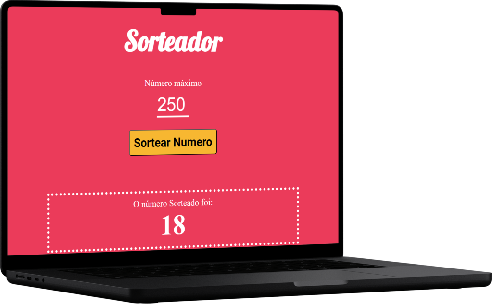
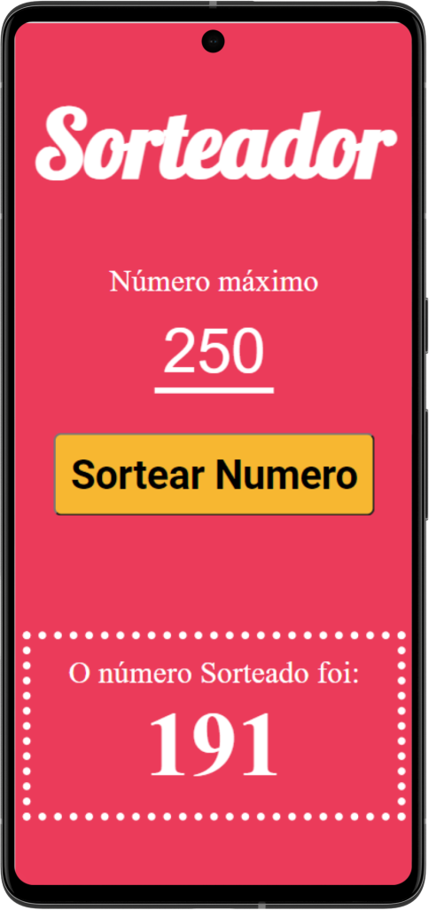

 
 

[Descrição](#--descrição-do-projeto-) |
[Funcionalidades](#%EF%B8%8F-funcionalidades) |
[Imagens](#-imagens-do-projeto-verão-web) |
[Tecnologias](#tecnologias-utilizadas-) |
[Como executar esse projeto ?](#%EF%B8%8F-como-executar-esse-projeto-) |
[Referências](#-referências-) |
[Autor](#-autor-) |

<h1 text-align="center"> 🌟Sorteador de Numeros🌟</h1> 
 

<h2> ✅ Descrição do Projeto: </h2> 

   Esse projeto nada mais é que um sorteador de numeros. Nele temos uma função em <strong>JavaScript</strong>que irá realizar uma pesquisa (dentro dos parametros incluidos dentro de uma função em JavaScript) e  retornar o Resultado. Para que isso aconteça temos que: 
    1. Temos que digitar o valor maxímo que queremos que o Site realize o Sorteio.  
    2. Depois  ao clicar na tecla <strong>Sorteador Numero<strong> após isso ira aparece o numero que o foi Sorteado pelo Site.      
   

  <h2>⚙️ Funcionalidades</h2>

 Realizar um Sorteio de um número de acordo com o valor maxímo que temos que inserir antes de clicar na tecla de Sortear Número.  

 

 <h2>📸 Imagens do Projeto verão web.</h2>

> :bulb: **Dica:** Imagen da versão Desktop.

 

 <h2>📱 Imagem do Projeto verão Mobile.</h2>

 > :bulb: **Dica:** Imagem da versão Mobile.

 

<h2>🪛Tecnologias Utilizadas </h2>

  
   
  
  
   
   

✅HTML 
✅CSS 
✅JAVASCRIPT 
✅NPM 
✅LESS 
✅GRUNT 

 <h2>🛣️ Como Executar esse projeto ?</h2>

Para ter Acesso ao Projeto; clique no link Abaixo:   

> [Sorteador de Numeros ](https://sorteadornumeros-tau.vercel.app/)

<h3>⬇️ Fazendo o Clone do Projeto</h3>

Para poder ter acesso a esse projeto e ver ele ronando no seu Computador você precisa ter em seu Computador os seguintes programas instalados: 
- [x]  [Vscode]() 
- [x]  [Git](https://git-scm.com/downloads) 
- [x]  [NodeJs](https://nodejs.org/pt-br/download)  
 

Caso já tenha os pré requistos listados acima crie um novo diretório📁(pasta) onde deseje que o projeto seja clonado no seu computador com o nome do Projeto <strong> Sorteador de Numeros</strong> clique  com o botão direito do mouse em cima dessa pasta e selecione abrir com o Vscode. 
Dentro do Vscode abra o termial e digite o seguinte comando: 

~~~~bash
npm install 
~~~~
> O NodeJs irá verificar as dependências necessárias pora que esse projeto seja executado em seu Computador. E irá instalar essas dependências.

Após ele relizar esse processo digite o seguinte comando no terminal 

~~~~bash
npm run grunt 
~~~~

Pronto  ✅ O Projeto já está sendo executado.

 

<h2> 📚Referências </h2>

> :memo: **Note:** [EBAC](https://origamid.com)

 <h2>👨🏻‍🦱 Autor </h2>
<h3> <a href="https://oliveira-portifolio.vercel.app/">Dev-Oliveira</a> </h3>
   
  
    
   
&copy; Todos os Direitos Reservados

<h3> 😁Obrigado por chegar até aqui!</h3>

